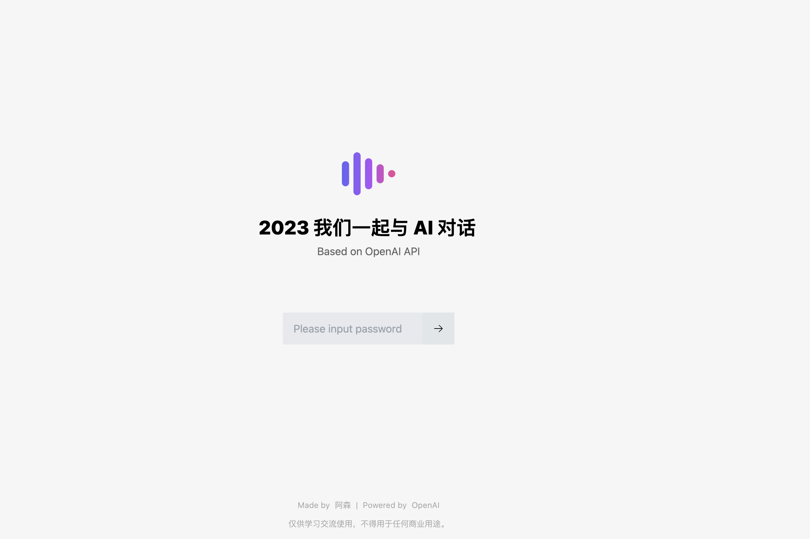

# [WIP] 2023 我们一起与 AI 对话

功能正在开发中。

## 屏幕截图

密码界面

聊天界面

自动补全

## 环境变量

| 名称                    | 用途                               | 是否必须 | 默认值                   |
| ----------------------- | ---------------------------------- | -------- | ------------------------ |
| OPENAI_API_BASE_URL     | 请求基础路径                       | 否       | https://closeai.deno.dev |
| OPENAI_API_ORG          | 在 OpenAI 注册获得的机构 ID        | 否       |                          |
| OPENAI_API_KEY          | 在 OpenAI 注册获得的 API Key       | 是       |                          |
| ANONYMOUS_USER_PASSWORD | 限制用户访问，不填为站点可公开访问 | 否       |                          |
| SUPER_USER_PASSWORD     | 可使用文本补全功能的用户           | 否       |                          |
| BAIDU_API_KEY     | 百度统计代码的 API KEY           | 否       |                          |

## 如何部署

参考 Astro 的 [部署文档](https://docs.astro.build/en/guides/deploy/)。

## 感谢

很多灵感来自以下开源项目，排名不分先后。

- [Chatgpt Vercel](https://github.com/ourongxing/chatgpt-vercel)
- [speechgpt](https://github.com/hahahumble/speechgpt)
- And more.

## License

MIT
